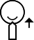
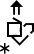
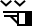
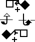
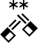

# SignWriting Description

Based on [sign/translate#130](https://github.com/sign/translate/issues/130).

The written representation of signed languages is challenging due to the complexities of various writing systems.
SignWriting, though beneficial, demand specialized linguistic expertise for effective use.

This repository aims to provide a solution for the automatic description of SignWriting in spoken languages.
This solution can be used for teaching SignWriting to new learners, fine-tuning translation models,
or zero-shot inference on motion generation models.

## Examples

In English, we make a few examples of SignWriting with translation and description.
While the translation is language specific, the description is language agnostic.
(This was generated using [`signwriting_description/few_shots/readme.py`](signwriting_description/few_shots/readme.py))

| SignWriting                                                                                                                                          | Translation    | Description                                                                                                                                                                  |
|------------------------------------------------------------------------------------------------------------------------------------------------------|----------------|------------------------------------------------------------------------------------------------------------------------------------------------------------------------------|
|                                                                    | Hello          | With your dominant hand open, touch your forehead and move your hand away, palm facing out.                                                                                  |
|                                                   | Thank You      | Touch your dominant open hand to your lips, then move your hand forward, palm up.                                                                                            |
|                                                        | Help (him/her) | Place your dominant hand's fist (thumb up) on the palm of your open non-dominant hand. Move both hands upward together.                                                      |
|                                                                               | No             | With your dominant hand, extend your index and middle fingers while keeping your other fingers tucked in. Tap these fingers against your thumb.                              |
|                                                                               | No             | Shake your head horizontally while forrowing your eyebrows.                                                                                                                  |
|                                                                                 | Sorry          | Form a fist with your dominant hand, palm facing in. Circle it over your heart.                                                                                              |
|  | Friend         | Link the index fingers of both hands together, alternating their positions.                                                                                                  |
|                              | Love           | Cross your arms over your chest as if giving yourself a hug, with your hands forming fists.                                                                                  |
|                                                                     | Name           | With your dominant hand, extend your index and middle fingers. Tap these fingers twice onto the extended index finger of your non-dominant hand, which is held horizontally. |

## Methodology

### Naive Description

We start with a naive description of the SignWriting image, by describing each symbol in the image.
We use the [symbol names](signwriting_description/symbols.json) to generate a
non-natural description ([naive_description](signwriting_description/naive_description.py)).

For example, the "Hello" sign above would be described as:

```txt
SIGNWRITING HEAD RIM (Head Rims) top right of the face at x: 482, y: 483
SIGNWRITING MOVEMENT-WALLPLANE DOUBLE STRAIGHT (Double Straight Movement, Wall Plane) dominant hand rotated 45 degrees clockwise at x: 525, y: 467
SIGNWRITING HAND-FLAT (Flat) left hand palm facing outwards, parallel to the wall rotated 45 degrees clockwise at x: 516, y: 482
```

This description is not natural, but it is a good start to name the symbols and their positions.

### GPT Description

To generate a more natural description, we use ChatGPT over the naive description, and SignWriting image.
We feed in all of the above examples for few-shot prediction.

For example, if we exclude each sign from the few-shots, we predict:

| SignWriting                                                                                                                                          | Translation    | Description                                                                                                                                  |
|------------------------------------------------------------------------------------------------------------------------------------------------------|----------------|----------------------------------------------------------------------------------------------------------------------------------------------|
|                                                                    | Hello          | Place your non-dominant flat hand near the side of your head, palm facing out. Move it outward in two straight motions.                      |
|                                                   | Thank You      | With a smile, place your flat dominant hand under your chin and move it slightly upward.                                                     |
|                                                        | Help (him/her) | Start with your dominant hand open, palm up. Touch your thumb to your palm, then move your hand forward and slightly upward.                 |
|                                                                               | No             | With your dominant hand, form a fist with the index, middle fingers, and thumb extended. Move your hand up and down in a large hinge motion. |
|                                                                               | No             | Move your head straight forward while furrowing your eyebrows downward.                                                                      |
|                                                                                 | Sorry          | With your dominant hand in a fist, rub your thumb in a circular motion against your palm.                                                    |
|  | Friend         | With both hands, extend and bend your index fingers. Move them in a grasping motion, rotating your wrists slightly as if turning a knob.     |
|                              | Love           | Cross your arms in front of you, forming fists with both hands. Tap your fists together once.                                                |
|                                                                     | Name           | Bring both hands together with index and middle fingers extended and touching, then tap them together repeatedly.                            |

## Evaluation

We use BLEU and chrF to compare the hand-written descriptions to the ones outputted by ChatGPT using
[`signwriting_description/evaluation.py`](signwriting_description/evaluation.py), resulting in:

| Model                        | BLEU  | chrF2 |
|------------------------------|-------|-------|
| GPT-4 Vision (deprecated).md | 14.42 | 37.03 |
| GPT-4 Omni (unknown).md      | 10.76 | 42.41 |
| GPT-4 Omni 2024-05-13.md     | 12.35 | 40.81 |
| GPT-4 Omni 2024-08-06.md     | 9.53  | 39.60 |

### Custom Model

Ideally, we would like to use a model that is trained on SignWriting descriptions.
We can generate a dataset using ChatGPT, and then fine-tune a model on this dataset.